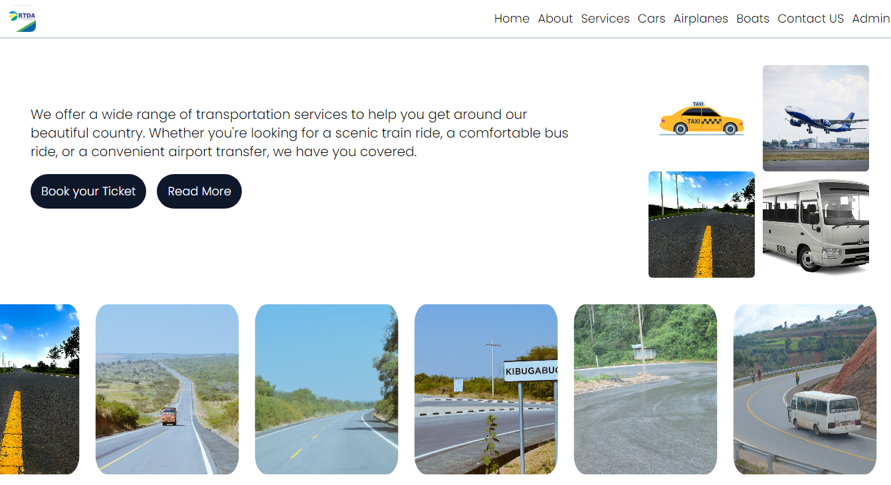

# Transport Pro

 

[](https://reactjs.org/)
[](https://firebase.google.com/)
[](https://opensource.org/licenses/MIT)

## Table of Contents

- [About the Project](#about-the-project)
- [Features](#features)
- [Screenshots](#screenshots)
- [Getting Started](#getting-started)
  - [Prerequisites](#prerequisites)
  - [Installation](#installation)
- [Usage](#usage)
- [Roadmap](#roadmap)
- [Contributing](#contributing)
- [License](#license)
- [Contact](#contact)
- [Acknowledgements](#acknowledgements)

## About the Project

Transport Pro is a fullstack web application built with React and Firebase. It showcases various cars available in the country, providing a platform for users to view and interact with car listings. This project is a personal endeavor to enhance my fullstack development skills.

## Features

- **Responsive Design**: Accessible on all devices, including mobile, tablet, and desktop.
- **Car Listings**: View details of various cars available in the country.
- **User Authentication**: Secure user authentication with Firebase.
- **Real-time Database**: Store and retrieve car listings using Firebase Firestore.
- **Interactive UI**: Enhance user experience with React Icons and other UI elements.

## Screenshots

### Home Page


### Car Listing


### Car Details


## Getting Started

To get a local copy up and running, follow these steps.

### Prerequisites

- Node.js
- npm or yarn
- Firebase account

### Installation

1. Clone the repository
   ```sh
   git clone https://github.com/your-username/transport-pro.git
   ```
2. Install NPM packages
   ```sh
   npm install
   # or
   yarn install
   ```
3. Create a `.env` file in the root directory and add your Firebase configuration
   ```env
   REACT_APP_API_KEY=your_api_key
   REACT_APP_AUTH_DOMAIN=your_auth_domain
   REACT_APP_PROJECT_ID=your_project_id
   REACT_APP_STORAGE_BUCKET=your_storage_bucket
   REACT_APP_MESSAGING_SENDER_ID=your_messaging_sender_id
   REACT_APP_APP_ID=your_app_id
   ```

## Usage

1. Start the development server
   ```sh
   npm start
   # or
   yarn start
   ```
2. Open [http://localhost:3000](http://localhost:3000) to view it in the browser.

## Roadmap

- [ ] Add more car details
- [ ] Implement user profiles
- [ ] Add booking functionality
- [ ] Integrate payment gateway

## Contributing

Contributions are what make the open source community such an amazing place to learn, inspire, and create. Any contributions you make are **greatly appreciated**.

1. Fork the Project
2. Create your Feature Branch (`git checkout -b feature/AmazingFeature`)
3. Commit your Changes (`git commit -m 'Add some AmazingFeature'`)
4. Push to the Branch (`git push origin feature/AmazingFeature`)
5. Open a Pull Request

## License

Distributed under the MIT License. See `LICENSE` for more information.

## Contact

Your Name - [your-email@example.com](mailto:your-email@example.com)

Project Link: [https://github.com/your-username/transport-pro](https://github.com/your-username/transport-pro)

## Acknowledgements

- [React](https://reactjs.org/)
- [Firebase](https://firebase.google.com/)
- [React Icons](https://react-icons.github.io/react-icons/)
- [Unsplash](https://unsplash.com/) for car images

